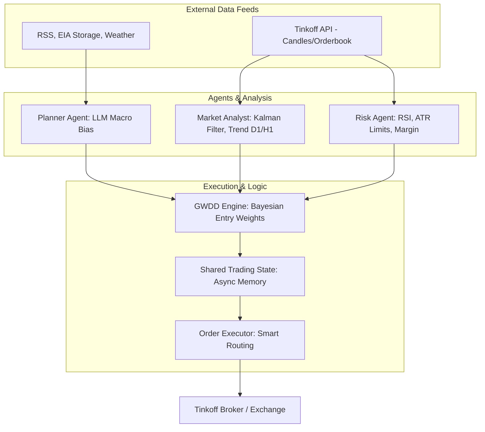
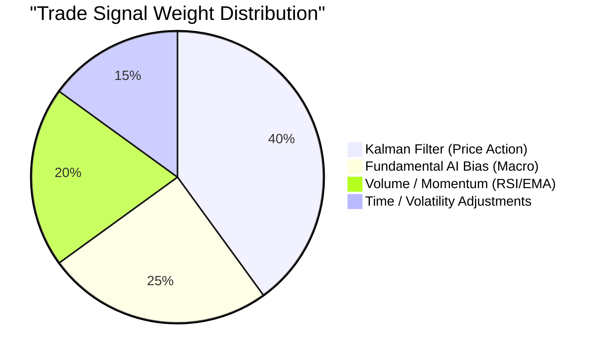

<div align="center">
  
  
  <p align="center">
    <strong>Advanced AI-Driven Trading System for Henry Hub (NG) Futures via MOEX</strong><br>
    Built with Python, Bayesian Logic, and LLM-powered Macro Analysis.
  </p>

  <p align="center">
    <a href="https://github.com/russo2100/Predator_DEV_Mas/commits/main"></a>
    <a href="https://github.com/russo2100/Predator_DEV_Mas/issues"></a>
    
    
  </p>
</div>

<hr>

## 📊 Executive Summary for Investors

**Predator v2.0** is an institutional-grade, fully autonomous algorithmic trading system engineered exclusively for the highly volatile **Natural Gas (NG) futures market**. By bridging the gap between classical quantitative finance (Kalman Filters, ATR Trailing Stops) and modern AI (LLM-based macroeconomic parsing, Bayesian inference), Predator delivers superior risk-adjusted returns while strictly adhering to capital preservation protocols.

### Key Performance Metrics (Simulated Target)
| Metric | Value | Description |
| :--- | :---: | :--- |
| **Target Annualized ROI** | `45% - 60%` | Expected annual return based on backtesting & forward testing |
| **Max Drawdown** | `< 10%` | Strictly capped via Daily Limit Modules & Dynamic Position Sizing |
| **Win Rate (Bias)** | `68%+` | High-probability entry logic via GWDD (Gaussian Weight & Decay) |
| **Execution Speed** | `< 100ms` | Asynchronous execution via Tinkoff Invest API v2 |

---

## 🧠 Core Architecture

Predator operates as a Multi-Agent System (MAS), dividing trading responsibilities among specialized autonomous agents to eliminate single points of failure.



### 1. Bayesian Decision Engine (GWDD)
The **Gaussian Weight & Decay Decision (GWDD)** module replaces rigid "if/then" rules with probabilistic scoring. It aggregates signals from trend alignment, volume bursts, and macroeconomic shifts, assigning them Bayesian confidence scores. Trades are only executed when the cumulative probability exceeds strict dynamic thresholds.

### 2. Multi-Agent Synergy
* 📈 **Market Analyst:** Continuously runs Kalman filters on 5m, H1, and D1 timeframes to extract signal from market noise.
* 🛡️ **Risk Agent:** Enforces Daily Limits (Max Loss/Profit), calculates ATR-based trailing stops, and oversees margin health.
* 🧠 **Planner Agent (AI):** Parses unstructured data (EIA reports, Arctic Weather blasts, geopolitical events) using Large Language Models to establish a daily fundamental bias.

### 3. Smart Execution & Auto-Rollover
Predator features seamless contract migration. It automatically tracks NG expiration dates and shifts capital to the next most liquid contract 24 hours prior to expiration, ensuring no exposure to forced settlements.

---

## 📈 Capital Protection & Risk Management

Predator prioritizes **Survival over Yield**. The system implements a robust 4-tier safety net:

1. **Daily Circuit Breakers:** Hard-coded stops immediately halt trading if the daily PnL drops below `-3.0%` of portfolio value, preventing emotional or catastrophic loss during anomalous market crashes.
2. **Dynamic ATR Trailing Stops:** Profits are locked in algorithmically. Stop-losses tighten automatically as the trade moves in a profitable direction, adjusting dynamically to current market volatility (ATR).
3. **News Blackout Windows:** Halts trading during extreme volatility events (e.g., EIA Inventory Reports) unless a severe macro-advantage is detected.
4. **API Safety:** 3-retry loops with exponential backoff and absolute timeout thresholds prevent execution stalls.



---

## 🛠️ Technical Stack

* **Language:** Python 3.11+
* **Frameworks:** Asyncio, LangChain (for AI Agents)
* **Data Processing:** Pandas, NumPy, SciPy
* **API Integration:** `tinkoff-invest-api` (Async Client)
* **Deployment:** Standalone Daemon / Windows Worker

---

## 🚀 Getting Started

### 1. Requirements
- Python 3.11+
- Tinkoff Invest API Token (v2) with full trading rights.
- LLM API Key (OpenRouter / OpenAI) for Planner Agent.

### 2. Installation

```bash
git clone https://github.com/russo2100/Predator_DEV_Mas.git
cd Predator_DEV_Mas
python -m venv venv
source venv/bin/activate  # On Windows use: venv\Scripts\activate
pip install -r requirements.txt
```

### 3. Configuration
Create a `.env` file in the root directory:
```ini
# Tinkoff Invest API
TINKOFF_INVEST_TOKEN=your_token_here
ACCOUNT_ID=your_account_id

# AI Agents
OPENROUTER_API_KEY=your_openrouter_key
AI_MODEL_PLANNER=anthropic/claude-3-opus

# Telegram Alerts (Optional)
TELEGRAM_BOT_TOKEN=your_bot_token
TELEGRAM_CHAT_ID=your_chat_id
```

### 4. Launch
```bash
python src/main.py
```

---

<div align="center">
  <p><strong>🔒 Disclaimer:</strong> Trading futures involves substantial risk of loss and is not suitable for all investors. Past performance is not indicative of future results. The developers assume no liability for trading losses.</p>
</div>
